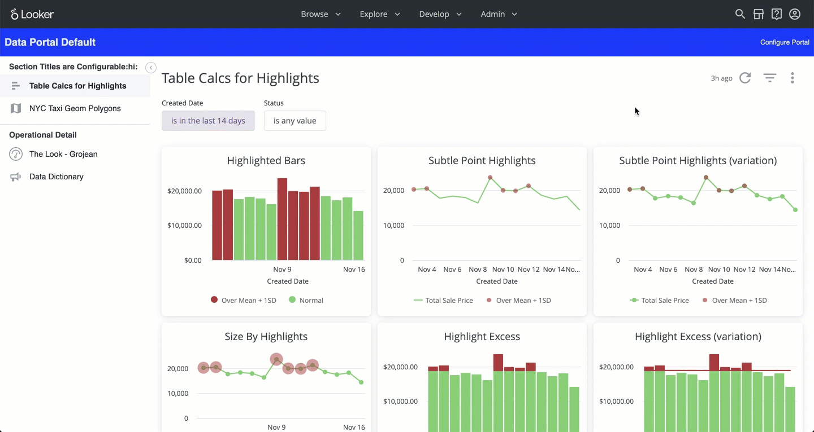

# Data Portal



## Configuration instructions

1. Add a user attribute named 'portal_board'
   - Admin -> User Attributes
   - Click 'Create User Attribute'
   - Name: portal_board
   - Label: Portal Board (will be set automatically from name)
   - Data Type: number
   - User Access: view (recommended – portal access should be based on group)
   - Hide Values: no
   - Set a default value: true
     - It's important to have a default board!

## TODOs

- Support for explores
- Complete and test packaging for Marketplace


## Looker Extension using React & JavaScript

The Data Portal uses [React](https://reactjs.org/) and JavaScript, the [React Extension SDK](https://github.com/looker-open-source/extension-sdk-react) for interacting with Looker, and [Webpack](https://webpack.js.org/) for building the code.

## Getting Started for Development

1. Clone or download a copy of this template to your development machine
2. Navigate (`cd`) to the template directory on your system
3. Install the dependencies with [Yarn](https://yarnpkg.com/).

    ```
    yarn install
    ```

    > You may need to update your Node version or use a [Node version manager](https://github.com/nvm-sh/nvm) to change your Node version.
4.  Start the development server
    ```
    yarn start
    ```

    Great! Your extension is now running and serving the JavaScript at http://localhost:8080/bundle.js.

    > __Note well:__ The webpack development server also supports https. To use, add the parameter --https to the start command
    `"start": "webpack-dev-server --hot --disable-host-check --https"`
    Should you decide to use https, you should visit the bundle URL you are running as there will likely be a certificate warning. The development server runs with a self-signed SSL certificate, so you will need to accept this to allow your browser to connect to it.

    The default yarn start command runs with hot module replacement working. Some changes will cause a full reload of the extension iframe. When this happens the extension framework connection will break. You should see an error. You will need to do a full page reload of the outer page.
5. Now log in to Looker and create a new project.

   This is found under __Develop__ => __Manage LookML Projects__ => __New LookML Project__.

   You'll want to select "Blank Project" as your "Starting Point". You'll now have a new project with no files.
6. In your copy of the extension tablet you have `manifest.lkml` file.

    You can either drag & upload this file into your Looker project, or create your own manifest file (e.g. to change the extension name).
7. Update the `data_portal.model.lkml` file in your project:
    - Add a [connection parameter](https://docs.looker.com/r/lookml/types/model/connection) to this model. It can be any connection, it doesn't matter which.
    - [Configure the model you created](https://docs.looker.com/r/develop/configure-model) so that it has access to the connection.
8. Connect your new project to Git. You can do this multiple ways:
    - Create a new repository on GitHub or a similar service, and follow the instructions to [connect your project to Git](https://docs.looker.com//r/api/pull-request)
    - A simpler but less powerful approach is to set up git with the ["Bare" repository](https://docs.looker.com/r/develop/bare-git-repo) option which does not require connecting to an external Git Service.
9.  [Commit your changes](https://docs.looker.com/r/develop/commit-changes) and [deploy your them to production](https://docs.looker.com/r/develop/deploy-changes) through the Projects page UI.
10. Reload the page and click the `Browse` dropdown menu. You should see your extension in the list.
    - The extension will load the JavaScript from the `url` you provided in the `application` definition/
    - Reloading the extension page will bring in any new code changes from the extension template. (Webpack's hot reloading is not currently supported.)

## Deployment

The process above requires your local development server to be running to load the extension code. To allow other people to use the extension, we can build the JavaScript file and include it in the project directly.

1. In your extension project directory on your development machine you can build the extension with `yarn build`.
2. Drag and drop the generated `dist/data_portal.js` file into the Looker project interface
3. Modify your `manifest.lkml` to use `file` instead of `url`:
    ```
    application: data-portal {
      label: "Data Portal"
      file: "data_portal.js"
    }
    ```

## Notes

- Webpack's module splitting is not currently supported.
- The template uses Looker's component library and styled components. Neither of these libraries are required so you may remove and replace them with a component library of your own choice,

## Related Projects

### Libraries used

- [Looker extension SDK for React](https://www.npmjs.com/package/@looker/extension-sdk-react)
- [Looker SDK](https://www.npmjs.com/package/@looker/sdk)
- [Looker Components](https://components.looker.com/)
- [Styled components](https://www.styled-components.com/docs)

### Extension templates for comparison (using TypeScript)

- [Looker React extension template](https://github.com/looker-open-source/extension-template-react)
- [Looker React/Redux extension template ](https://github.com/looker-open-source/extension-template-redux)
- [Looker kitchensink extension template ](https://github.com/looker-open-source/extension-template-kitchensink)
